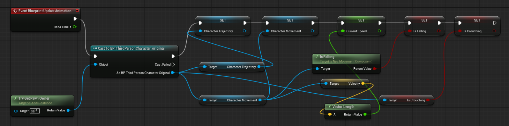
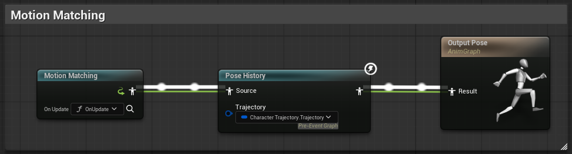
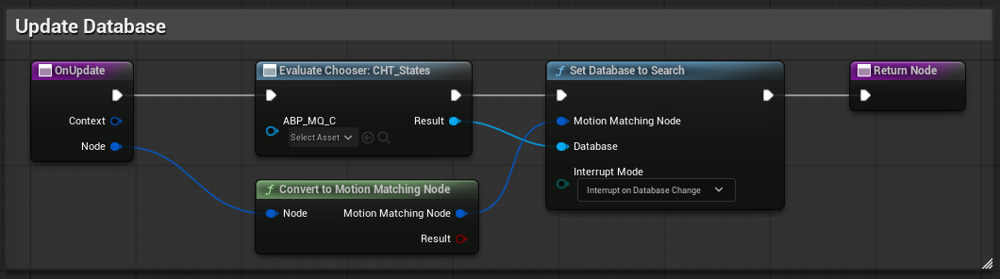
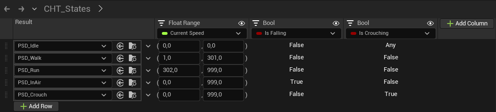
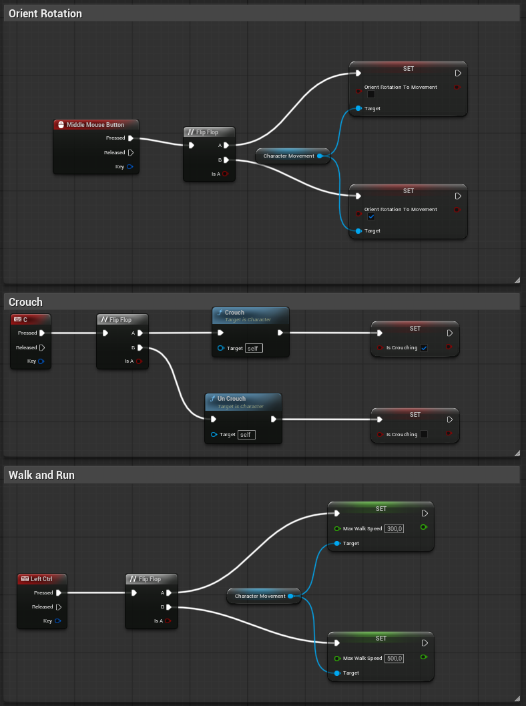
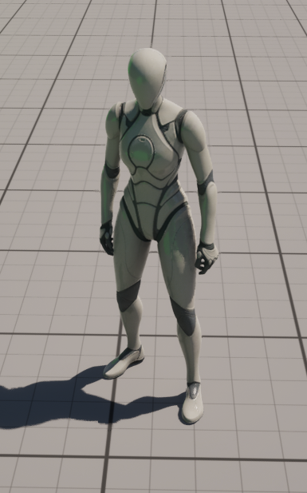
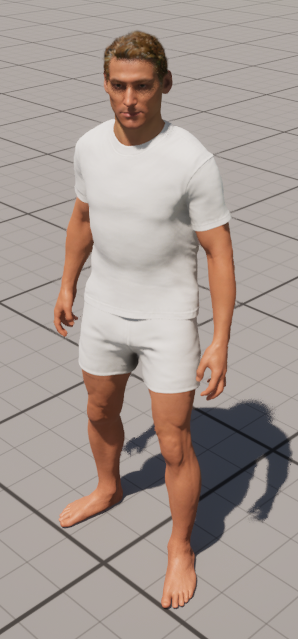

# Exploring Motion Matching and Animation Retargeting in UE5

# 📑 Index

- [Project Goal](#-project-goal)
- [Requirements](#️-requirements-and-plugins)
- [Project Structure](#️-project-structure)
- [Implementation](#-implementation)
  - [Motion Matching and Retargeting](#motion-matching-and-retargeting)
  - [Metahuman](#metahuman)
- [Results](#-results)  
- [Authors](#-authors)


# 🎯 Project Goal
The purpose of this project is to become familiar with **Motion Matching**, **Retargeting** and  **MetaHuman** in **Unreal Engine 5**, exploring their workflows and practical applications in character animation.

- **Motion Matching**: is an animation technique that dynamically selects the most appropriate animation pose from a large database of motion data in real time. Instead of relying on predefined animation states and transitions, the system continuously compares the character’s current pose and movement intent with the available animation data, resulting in smoother, more natural, and more responsive character movement.

- **Retargeting**: is the process of transferring animations from one skeletal mesh to another with a different skeleton structure or proportions. Unreal Engine 5’s retargeting system allows animations created for a source character to be accurately adapted to a target character, preserving motion quality while reducing the need to recreate animations for each new character.

- **MetaHuman**: as part of this project, MetaHuman characters are explored to test and validate motion matching and retargeting workflows on digital humans.

# ⚙️ Requirements and Plugins

We used **Unreal Engine 5.6**.  
Enable the following **Plugins** in UE:
- Pose Search
- Motion Trajectory
- Animation Warping
- Motion Warping
- Animation Locomotion Library
- Deformer Graph
- Chooser
- Metahuman Creator
- Metahuman Core Tech

# 🗂️ Project Structure

```
└── 📁 MotionMatching
    ├── 📁 Databases
    │   ├── 📄 PSD_Crouch.uasset
    │   ├── 📄 PSD_Idle.uasset
    │   ├── 📄 PSD_Jump.uasset
    │   ├── 📄 PSD_Run.uasset
    │   └── 📄 PSD_Walk.uasset
    ├── 📄 CHT_States.uasset
    ├── 📄 PSS_Default.uasset
    └── 📄 PSS_Jump.uasset
    
```

Here we put only the most important files of our project:
- **Databases folder:** contains the Pose Search Databases for each character action (Idle, Walk, Run, Jump, Crouch). Each database stores the animation poses used by the Pose Search system to select the best matching animation at runtime.
- **CHT_States:** Chooser Table used to switch between different Pose Search Databases based on specific gameplay conditions (for example, character state, movement speed, or input).
- **PSS_Default:** Default Pose Search Schema, which defines how poses are evaluated and compared. It specifies the features, costs, and weighting used by the Pose Search system to find the most suitable animation.
- **PSS_Jump:** Pose Search Schema specifically tailored for jump animations, with settings optimized for airborne motion and landing transitions.


# 📋 Implementation

## Motion Matching and Retargeting

1. For the motion matching we import the animation of the [Game Animation Sample Project](https://dev.epicgames.com/documentation/en-us/unreal-engine/game-animation-sample-project-in-unreal-engine)
2. Perform animation retargeting using our custom character
3. Set the same skeleton on the Third Person Character Blueprint
4. Create a MotionMatching folder; create a Pose Search Schema using the same skeleton selected before; Create a databases folder;create a Pose Search Database for each desired action (Idle, Walk, Run, Jump, Crouch)
5. Add the retargeted animations (point 2) to their corresponding databases.
6. Add the Character Trajectory component to the Third Person Character Blueprint
7. Create a new Animation Blueprint using the same skeleton
8. Build the following graph in the EventGraph in Animation BluePrint
<p align="center">
  
</p>
9. Build the following graph in the AnimGraph in Animation BluePrint
<p align="center">
  
</p>
10. Build the following graph in the OnUpdate in Animation BluePrint
<p align="center">
  
</p>
11. Create a Chooser Table: chooser type: Animation Chooser, Anim Class: ABP_MQ; output: PoseSearchDatabase.  
    Fill the table with 5 row for every action (idle, walk, run, jump, crouch) and 3 column for speed, isFalling and is Crouching.
12. Configure the table values to match the setup shown in the following image: 
<p align="center">
  
</p>
13. add the following graph to the Third Person Controller:
<p align="center">
  
</p>

**Note:** To visualize the trajectory, simply add the Character Trajectory to the character component. Then, from the Unreal Engine console, run the following command: ```a.CharacterTrajectory.Debug 1```

<u>At the end we came up with the character with motion matching implementation, using the default UE character:</u>
<p align="center">
  
</p>

## Metahuman 

1. We export a ready-to-use MetaHuman (1).
2. We explore the MetaHuman Creator in Unreal Engine and create a custom MetaHuman (2).
3. We replace the materials and textures of (1) with those from our custom MetaHuman (2).
4. Motion Matching now works correctly with our custom MetaHuman.
<p align="center">
  
</p>


# 🎮 Results

Here you have a demonstration of the implemented system.
We tested all the movement imputs listed below:

| Input        | Action                                         |
|--------------|------------------------------------------------|
| **WASD**     | Move the character forward, backward, left, and right |
| **Space**    | Jump                                           |
| **Ctrl**     | Walk                                           |
| **C**        | Crouch                                         |
| **Mouse wheel** | Lock the character’s camera view            |

<p align="center">
  <video src="demo_video.mp4" width="90%" controls></video>
</p>

# 👥 Authors

Nicola Cappellaro - nicola.cappellaro@studenti.unitn.it  
Riccardo Zannoni  - riccardo.zannoni@studenti.unitn.it
